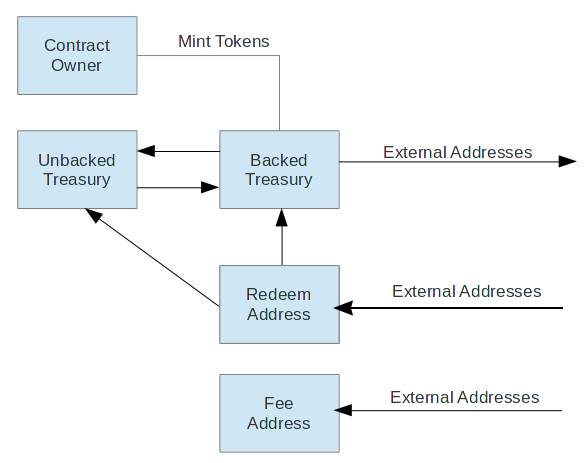

# Token Description

The Cache Gold Token (CGT) is an ERC-20 compatible token in which 1 token represents 1 gram of physical gold. All gold tokens minted are backed by physical gold held in reserves at participating fully audited vaults and may be redeemed for physical gold.

While this token inherits the ERC-20 interface, there are extra properties of the token that are non-standard. In particular, the token has the ability to charge a storage fee that accrues over time as the token is held and a transfer fee that is paid when tokens are transferred to other unique address. These fees are paid in the native token itself, and are separate from the transactions fees paid in ETH when transacting on the Ethereum network. These fees are collected opportunistically when users transact.

### Fee Overview

Please read the [Fees Guide](./FEES.md) for a detailed overview of the storage and transfer fees.

### Internal Cache Addresses

There are 6 addresses associated with the contract that have the special status as Cache "internal" addresses. These addresses are not subject to storage or transfer fees.

1.  Owner Address : The address owning the Cache Gold Token contract and the only account able to mint tokens and perform other administrative functions. This is a MultiSig address so that tokens can only be minted pending group approval.
2.  Backed Treasury Address : The backed treasury is where all tokens are minted to and where tokens enter circulation. For tokens to be minted, an equivalent amount of gold must to be locked and unencumbered in a participating audited vault, and the Locked Gold Oracle must be updated with this amount. The Backed Treasury is also a MultiSig address so transfers to external addresses cannot occur without group approval.
3.  Unbacked Treasury Address : The unbacked treasury is where tokens exit circulation. When tokens are redeemed for physical gold bars, the tokens will be moved to this address.
4.  Fee Address : The address where storage and transfer fees for external accounts are collected. This is also a MultiSig address so no single party has the ability transfer collected fees.
5.  Storage Fee Enforcer : This address is able to force paying storage fees or inactive fees on delinquent accounts.
6.  Redeem Address: The address tokens must be sent to when redeeming tokens for physical gold. Cache will use a KYC process to whitelist accounts that send to this address and monitor deposits for redemption of physical gold bars.

#### Transfer Restrictions

For security reasons, some addresses are restricted from sending to external addresses, and some can only receive tokens from certain addresses. The diagram below shows these rules. 



The Redeem Address can only transfer to the Backed or Unbacked Treasury. This insures that if the private key is hacked, the hacker can only move the tokens to other addresses controlled by Cache.

The Unbacked Treasury can only receive tokens from the Backed Treasury or the Redeem Address. When tokens enter the Unbacked Treasury the `totalCirculation()` decreases, therefore we want to ensure only addresses controlled by Cache can transfer there. The Unbacked Treasury can only transfer tokens to the Backed Treasury, and it is only allowed when the Locked Gold Oracle has sufficient supply to allow these tokens to re-enter circulation.


### Minting and Locked Gold Oracle

The contract keeps touch with the real world supply of locked gold via the Locked Gold Oracle contract. It's only function is to keep track of the amount of gold currently locked in participating vaults, and the Cache contract can check this value when adding new tokens to circulation to ensure it does not exceed the limit. 

The number of tokens in circulation at any given time is:
```
The total supply - balance of unbacked treasury
```
and it represented by the contract function `totalCirculation()`

When more gold is locked in the vault and the Locked Gold Oracle value is increased, the contract owner will call `addBackedTokens()` function to increase the circulating supply by a given amount. The function will first move tokens from the Unbacked Treasury balance to the Backed Treasury, and then mint any additional tokens if the Unbacked balance in insufficient to cover the total amount of tokens to add. 

Similarly, if we want to reduce the circulating supply, tokens must be moved to the Unbacked Treasury (which is restricted from transferring tokens to external addresses), and then the Locked Gold Oracle can be reduced by an equivalent amount.

### Contract Events

All ERC-20 compatible tokens issue two native events:

* `event Transfer(from, to, value)`
* `event Approval(tokenOwner, spender, value);`

These allow any user to query ethereum nodes for a history of `Transfer` or `Approval` events, additionally being able to filter by the addresses either sending/receiving tokens or being approved for transfer.

In addition to these events, Cache Tokens will emit four additional events:

* `event AddBackedTokens(amount)`
* `event RemoveTokens(amount)`

These represent events where the circulating supply of the token has changed, and can be used by a third party with auditing the history of the supply, or to listen for circulation changes.

* `event AccountInactive(address account, uint256 feePerYear)`
* `event AccountReActive(address account)`

These events are trigger when an account is marked inactive or reactivated. These events would allow anyone to quickly query which accounts are inactive based on the contract event log.
